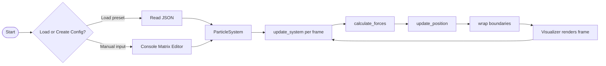

# 🧬 Particle Life Simulation

A real-time particle simulation demonstrating **emergent behavior** based on simple interaction rules between particle types.

Developed for the course **Data Science & AI Infrastructures (WS 2025/2026)**.


---

## Overview

This project implements a dynamic particle system in Python where multiple particle types interact via **attraction and repulsion forces** defined in an interaction matrix. From simple local rules, complex global movement patterns emerge in real time.

The project focuses on clean architecture, configurability, and performance-aware simulation design.

---

## Installation

Clone the repository and install dependencies:

```bash
git clone https://github.com/lisa-vdoviuk/particle-life.git
cd particle-life
pip install -r requirements.txt
```

---

## Running the Simulation

```bash
python src/main.py
```

At launch you can:
- Load an existing JSON preset, or
- Enter a custom interaction matrix via console

After configuration, the visualization window opens automatically.

---

## System Architecture

...

## Simulation Flow



---

## Project Structure

```
src/
├── main.py                # Entry point and setup
├── particle_class.py      # Particle data model and movement logic
├── particle_system.py     # Core simulation and force calculations
├── interaction_matrix.py  # Interaction rules between particle types
├── simulation_config.py   # Central configuration + JSON presets
├── visualizer.py          # Rendering and interactive UI
├── presets/               # Saved JSON configuration presets
requirements.txt
```

---

## Module Overview

### `Particle` — `particle_class.py`
- Stores position, velocity, type, and color
- Updates movement and applies forces
- Handles friction, velocity clamping, and random jitter

### `ParticleSystem` — `particle_system.py`
- Manages all particles
- Computes local interaction forces using a spatial grid
- Accelerated via **Numba JIT** kernel (`@njit`) when available
- Includes a pure Python fallback for force computation

### `InteractionMatrix` — `interaction_matrix.py`
- Stores a `num_types × num_types` matrix of attraction/repulsion values `[-1.0, 1.0]`
- Can be randomized or configured manually via console or UI

### `SimulationConfig` — `simulation_config.py`
Central storage for all simulation parameters:

| Parameter | Description |
|---|---|
| `friction` | Damping applied to velocities each frame |
| `max_velocity` | Speed cap for all particles |
| `interaction_radius` | Cutoff distance for force computation |
| `random_motion` | Random jitter added to velocity each frame |

Supports **saving and loading presets as JSON**.

### `Visualizer` — `visualizer.py`
- Real-time rendering via **Pygame**
- Trail effect using a fading alpha surface
- Interactive control panel: sliders, buttons, interaction heatmap
- Supports particle selection via mouse click

---

## Simulation Logic

Each frame:

1. Forces between nearby particles are computed based on distance, type, and the interaction matrix
2. Forces update particle velocities
3. Positions are updated with friction, random motion, and velocity clamping
4. Particles wrap around simulation boundaries
5. Everything is rendered in real time

This produces emergent clustering, swarming, and dynamic flow patterns.

---

## Controls

| Input | Action |
|---|---|
| `Space` | Pause / Resume |
| Mouse click | Select a particle |
| **Sliders** | Adjust radius, chaos, particle size |
| **Randomize** | Randomize interaction matrix |
| **Reset** | Reset all particles |
| **Edit** | Open interaction heatmap editor |

---

## Features

- Multiple particle types with unique behaviors
- Attraction/repulsion defined by an editable interaction matrix
- Real-time Pygame visualization with trail rendering
- Numba-accelerated force computation
- Save/load configuration presets as JSON
- Interactive heatmap for matrix editing

---

## Testing

Run tests:
```bash
pytest
```

Coverage:
```bash
pytest --cov=rcs
```
or with html report
```bash
pytest --cov=src --cov-report=html
```

Continuous integration is configured via GitHub Actions.

---

## Team

- Yelyzaveta Vdoviuk
- Oleksii Zvirkovskyi
- Thorben Linzmaier
- Emen Fouda

---
## License

For academic use only. 
